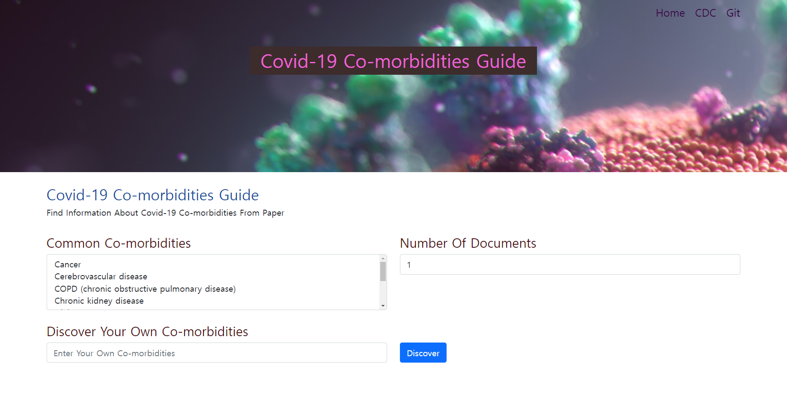

<h1 align="center">
    <p>COVID-19 comorbidities analysis web platform</p>
</h1>
<a align="center" href="https://colab.research.google.com/drive/1VT7gEQmhTYosZ98qfRYa5jCU97ymq0z-?usp=sharing">
  
</a>

## What we built
This platform analyzes the risk of covid-19 for the user's comorbidities based on natural language processing.
The analysis was based on version 81 of the [CORD-19](https://pages.semanticscholar.org/coronavirus-research) dataset.
* User makes input about comobidities.
* Print excerpts of paragraphs deeply related to the user's comorbidities.
* Provide information about the paper, such as authors, design method and number of samples.
* Particularly relevant parts are highlighted in green.

[BioBERT fine-tuned](https://huggingface.co/ktrapeznikov/biobert_v1.1_pubmed_squad_v2) on [SQuAD2.0](https://rajpurkar.github.io/SQuAD-explorer/) and [BM25](https://en.wikipedia.org/wiki/Okapi_BM25) were used for paper selection and paragraph excerpts.

[Bootstrap](https://github.com/twbs/bootstrap), [Node.js](https://github.com/nodejs/node) & [Express](https://github.com/expressjs/express), [EJS](https://ejs.co/), [npm's python shell](https://www.npmjs.com/package/python-shell) and [Apache](https://httpd.apache.org/) were used for building web.

Data preprocessing, model architecture, etc. were referenced from other great Kaggle notebooks. In particular, for additional metadata such as design methods and number of samples, we refer to [this Kaggle notebook](https://www.kaggle.com/davidmezzetti/cord19-study-design). The notebooks referenced are summarized below.

Team Members:  
**Seokhan Noh, Seungun Jang**

## Features

[](https://www.youtube.com/watch?v=ymSe6zo-rSo) 


## Getting started

- We assume you have installed PyTorch, necessary CUDA packages and Node.js.  

    ```
    # Setup virtual environment using conda
    conda create -n ccnw 
    conda activate ccnw

    # Install git-lfs
    curl -s https://packagecloud.io/install/repositories/github/git-lfs/script.deb.sh | sudo bash
    sudo apt install git-lfs

    # Clone repository
    git clone https://github.com/AI-STACK-dev/Covid19-Comorbidities-NLP-WEB.git
    cd Covid19-Comorbidities-NLP-WEB
    pip install -r requirements.txt
    ```
    If everything fine, run

    ```
    node main.js
    ```


## External code and References
This project would not have been possible without following great resources.
- Data
    - [CORD-19](https://pages.semanticscholar.org/coronavirus-research)
    - [SQuAD2.0](https://rajpurkar.github.io/SQuAD-explorer/)
- Data preprocessing
    - [Nakatani Shuyo's language-detection](https://pypi.org/project/langdetect/)
    - [davidmezzetti's paperai](https://github.com/neuml/paperai)
    - [davidmezzetti's paperetl](https://github.com/neuml/paperetl)
    - [dskswu's topic-modeling-bert-lda](https://www.kaggle.com/dskswu/topic-modeling-bert-lda/notebook)
    - [danielwolffram's cord-19-create-dataframe](https://www.kaggle.com/danielwolffram/cord-19-create-dataframe)
    - [fmitchell259's create-corona-csv-file](https://www.kaggle.com/fmitchell259/create-corona-csv-file)
    - [davidmezzetti's cord-19-etl](https://www.kaggle.com/davidmezzetti/cord-19-etl/data)
    - [davidmezzetti's cord19-study-design](https://www.kaggle.com/davidmezzetti/cord19-study-design)
    - [davidmezzetti's cord19-fasttext-vectors](https://www.kaggle.com/davidmezzetti/cord19-fasttext-vectors)

- NLP model & pipeline
    - [BioBERT fine-tuned on SQuAD2.0](https://huggingface.co/ktrapeznikov/biobert_v1.1_pubmed_squad_v2)
    - [BM25](https://github.com/dorianbrown/rank_bm25)
    - [nadergo's risk-factors-question-answering-biobert](https://www.kaggle.com/nadergo/risk-factors-question-answering-biobert)
